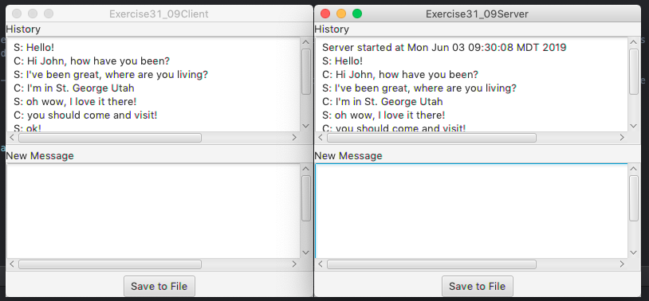

# Intro-To-Programming

This repository holds my class assignments from CSCI 1105 - Introduction to Programming at Southwest Technical College.

# Final Project Information

## Chat Server Printer
This project is a chat program that connects between server and client. My chat server will be unique because it will have a save and print function, which can save the chat communication between server and client into a pdf document.
 
The target population will be ages 16-29. It will appeal to the users because it will allow them to save their chats between one another. Saving chat is something I haven’t often seen, and I think the implementation would be valuable and useful to the user.
 

This program is unique because it allows the user to save and print a file of their chats. Often times, I will have to dig through old texts and messages, scrolling endlessly. This program will allow the user to save their messages often, and use them for reference.
 

The program is helpful because nothing like it exists that I’ve used. I’d love to be able to see report, or files, of my communication between people, and this would help solve that issue.

## Example Run


## Code Example
This code is important because it creates a server socket and listens for a connection request.
```
	new Thread(() -> {
		try {
			// Create a server socket
			ServerSocket serverSocket = new ServerSocket(8000);
			Platform.runLater(() ->
				taServer.appendText("Server started at " + new Date() + '\n'));
				
				// Listen for a connection request
				Socket socket = serverSocket.accept();
				
				// Create data input and output streams
				inputFromClient = new DataInputStream(socket.getInputStream());
				outputToClient = new DataOutputStream(socket.getOutputStream());
				
				while (true) {
					// Receive info from the client
					String taClient = inputFromClient.readUTF().trim();
					
					// Send info back to the client
				 //outputToClient.writeUTF(taServer.getText());

					
					Platform.runLater(() -> {
						taServer.appendText("C: " + taClient + "\n");
					});
				}
		}
		catch(IOException ex) {
			ex.printStackTrace();
		}
	}).start();
}
```

## Installation
Download reopository. Enter into Chat Server Project folder and run chat and server java files.

## Contributing
Please make contributions to Github at the location "https://github.com/adamanderson166/Intro-To-Programming/tree/master/Chat%20Server%20Printer%20Project"

## Licence
There is no license to this software