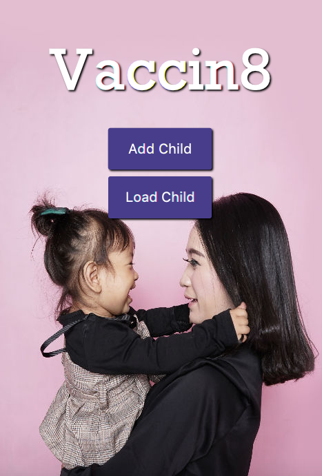

# Intro-To-Programming

This repository holds my class assignments from CSCI 1105 - Introduction to Programming at Southwest Technical College.

# Capstone Project Information

## Health Survey
With all the debate and controversy surrounding Vaccinations, I thought it would be a good idea to create a tool that can helps new parents with the vaccination process. My tool will provide parents with a vaccination schedule as well as provide them with resources which help them learn about vaccinations.

## Example Run


## Code Example
This code is contains a TableView and a SetCellFactory function that takes the users information and puts it into a format that is understandable to user.
```
TableView<Vaccine> table = new TableView<Vaccine>();
final ObservableList<Vaccine> data = FXCollections.observableArrayList(
	new Vaccine("Chickenpox1", chickenPox1String, "(800) 338-2382"),
	new Vaccine("Chickenpox2", chickenPox2String, "(800) 338-2382"),
	new Vaccine("Diphteria", diphteriaString, "(800) 338-2382"),
	new Vaccine("Haemophilus", haemophilusString, "(800) 338-2382"),
	new Vaccine("Hepatitis A", hepatitisAString, "(800) 338-2382"),
	new Vaccine("Hepatitis B", hepatitisBString, "(800) 338-2382"),
	new Vaccine("Influenza", influenzaString, "(800) 338-2382"),
	new Vaccine("MMR", mmrString, "(800) 338-2382"),
	new Vaccine("Meningococcal", meningococcalString, "(800) 338-2382"),
	new Vaccine("Polio", polioString, "(800) 338-2382"),
	new Vaccine("Rotavirus", rotavirusString, "(800) 338-2382")
);

TableColumn columnOne = new TableColumn<>("Vaccine");
columnOne.setCellValueFactory(new PropertyValueFactory<Vaccine, String>("vaccineName"));
TableColumn columnTwo = new TableColumn<>("Due Date");
columnTwo.setCellValueFactory(new PropertyValueFactory<Vaccine, String>("vaccineDate"));
TableColumn columnThree = new TableColumn<>("Contact");
columnThree.setCellValueFactory(new PropertyValueFactory<Vaccine, String>("vaccineContact"));
```

## Installation
Download reopository. Enter into ITEC_2905_Capstone folder and run Vaccin8_AppV3.java.

## Contributing
Please make contributions to Github at the location "https://github.com/adamanderson166/Intro-To-Programming/tree/master/ITEC_2905_Capstone"""

## Licence
There is no license to this software
